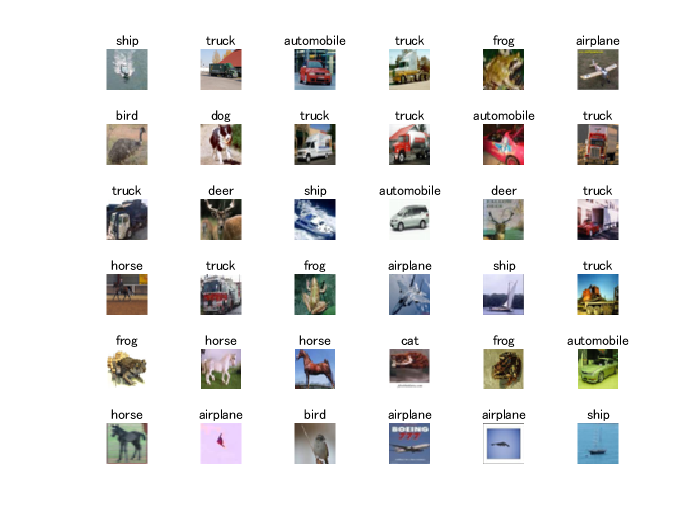
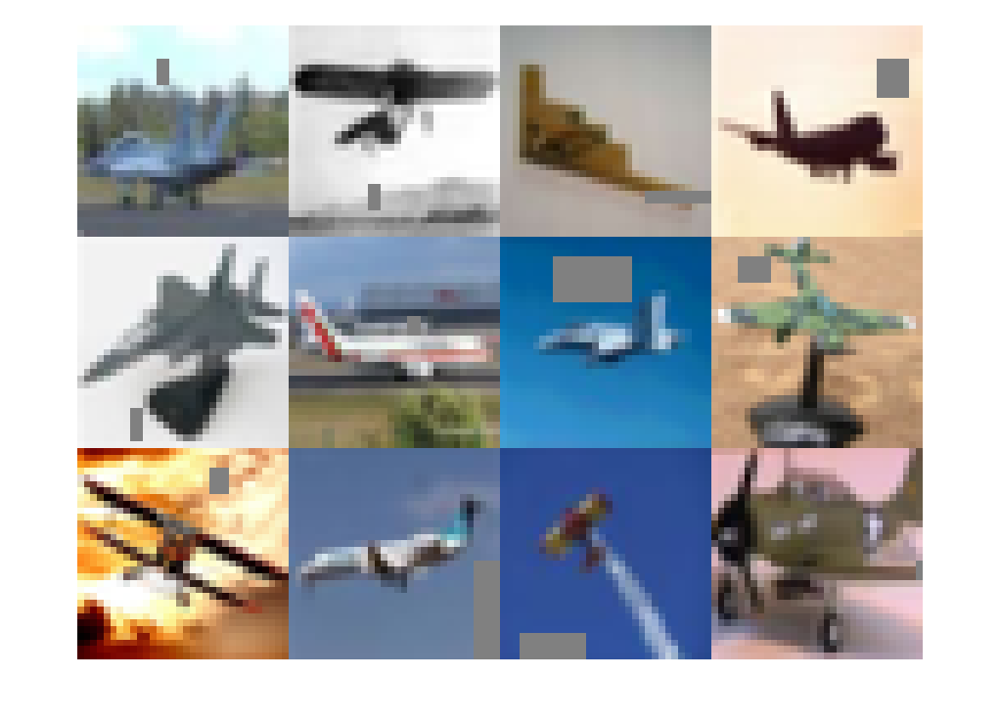
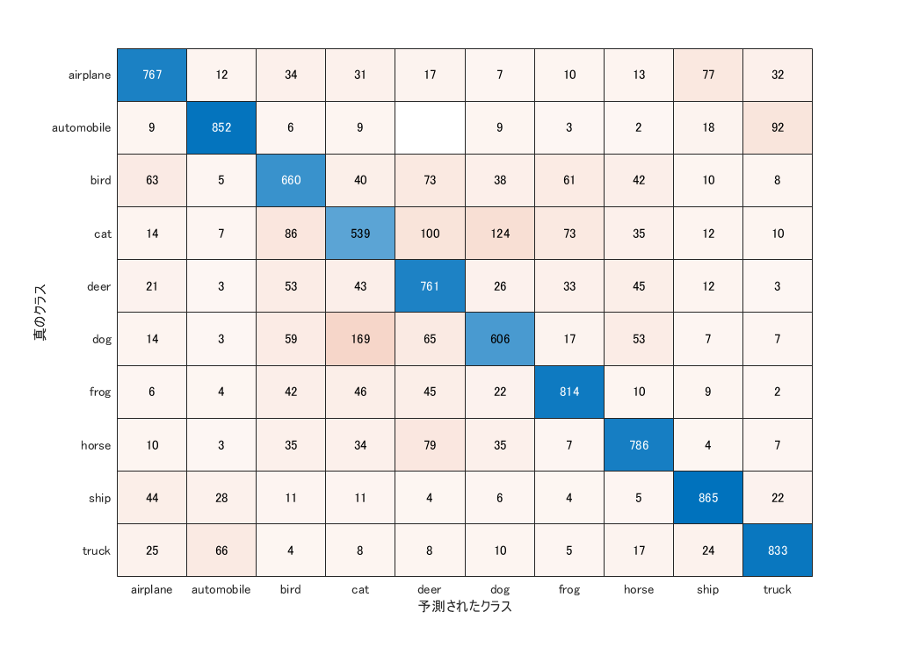

[](https://jp.mathworks.com/matlabcentral/fileexchange/98034-cnn-classification-using-random-erasing-and-cut-out)
# CNN classification using random erasing / cut out

**[English]**

This demo shows how to perform random erasing/cut out augmentation in CNN classification as explained in [1] and [2]. A rectangle mask was created randomly on the training images to escape overfitting as shown below. In this demo, a gray color mask was made and the height and width ranged from 1 to the half of the image size. The color and size of the mask can be changed in the custom function at the end of this script.  The test accuracy with/without the random erasing/cut out was compared; the test accucacy with the technique was significantly higher tan that without the random erasing/cut out. Because the network with it, to some extent, escape the over-fitting to the training data. This was done with cifar-10 dataset. You may alleviate the over-fitting using the random erasing/cut out. 

**[Japanese]**

このスクリプトでは、cut outやrandom erasingと呼ばれる方法 [1, 2] を用いてデータ拡張をし、さらに畳み込みニューラルネットワーク（CNN)にて分類をする例を示します。過学習を防ぐために、訓練データセットの画像にランダムに長方形のマスクをかけ、その画像をもとに学習を行います。Cifar-10とよばれるデータセット [3, 4]を用いてこのデータ拡張によって、分類精度が上昇することを確認できます。輝度値が128のグレーのマスクをかけていますが、訓練データ内の輝度値の平均を使ったり、ゴマ塩ノイズを乗せたりと工夫をすることでさらなる精度上昇の可能性も考えられます。

**[Key words]**

augmentation, cifar-10, classification, cnn, cut out, data augmentation, over-fitting, over-tune, random erasing


[1] [Zhong, Z., L. Zheng, G. Kang, S. Li, and Y. Yang. "Random erasing data augmentation. arXiv 2017." arXiv preprint arXiv:1708.04896.](https://arxiv.org/abs/1708.04896)

[2] [DeVries, Terrance, and Graham W. Taylor. "Improved regularization of convolutional neural networks with cutout." arXiv preprint arXiv:1708.04552 (2017).](https://arxiv.org/abs/1708.04552)

[3] Krizhevsky, A., and G. Hinton. "Learning multiple layers of features from tiny images." Master's Thesis. University of Toronto, Toronto, Canada, 2009.

[4] The CIFAR-10 dataset (\href{https://www.cs.toronto.edu/~kriz/cifar.html}{https://www.cs.toronto.edu/\textasciitilde{}kriz/cifar.html})

# Download and store the cifar-10 images

The helper function called downloadCIFARToFolders automatically save the cifar10 images to the current directory. This helper function is provided by MathWorks ([https://jp.mathworks.com/help/deeplearning/examples/upload-deep-learning-data-to-the-cloud.html](https://jp.mathworks.com/help/deeplearning/examples/upload-deep-learning-data-to-the-cloud.html)). This takes some time but, if the folder already exists, this step is skipped. 

```matlab:Code
clear;clc;close all
if exist('cifar10\')~=7
   [trainDirectory,testDirectory] = downloadCIFARToFolders(pwd);
end
```


The `cifar10` images were stored in the imagedatastore. A portion of training dataset was used for validation image. 

```matlab:Code
cd('cifar10')
imds = imageDatastore('train','IncludeSubfolders',true,'LabelSource','foldernames'); 
[imdsTrain,imdsValidation] = splitEachLabel(imds,0.9);
imdsTest = imageDatastore('test','IncludeSubfolders',true,'LabelSource','foldernames'); 
```

# Randomly display images

Display some example of images. The augmented datastore returns images which are different at each time even with the identical index. 

```matlab:Code
% specify the number of images to display
numDisplay=36;
numTrain=numel(imdsTrain.Files);
% the randperm function returns a randomized permutation of integers
idx=randperm(numTrain,numDisplay);
% loop over the index
figure
for i=1:numDisplay
   Input=readimage(imdsTrain,idx(i));
   class=cellstr(imdsTrain.Labels(idx(i)));
   subplot(6,6,i)
   imshow(Input);title(class{1})
end
```



# Define layers

The network consists of three layers. You can define each layer easily such as with `convolution2dLayer`.  For the detail, please check the comment below. Alternatively, you can define the CNN layer using a GUI tool called `deepNetworkDesigner`. 

```matlab:Code
numFilters=75;
layers = [
    % image input layer whose input size is 32-32-1. "3" represents one
    % color channel (RGB image)
    imageInputLayer([32 32 3]) 
    % convolutional layer whose filter size is 3 by 3 
    convolution2dLayer(3,numFilters,'Padding','same')
    % batch normalization layer
    batchNormalizationLayer
    % activation layer (relu)
    reluLayer
    
    maxPooling2dLayer(2,'Stride',2)
    
    convolution2dLayer(3,numFilters*2,'Padding','same')
    batchNormalizationLayer
    reluLayer
    
    maxPooling2dLayer(2,'Stride',2)
    
    convolution2dLayer(3,numFilters*4,'Padding','same')
    batchNormalizationLayer
    reluLayer
    
    fullyConnectedLayer(10)
    softmaxLayer
    classificationLayer];
```

Analyze the network architecture using `analyzeNetwork` function. If you would like to analyze it, please activate the following line.

```matlab:Code
% analyzeNetwork(layers)
```

# Display some masked images

To prepare the masked images, please use the `transform` function which transform images stored in the imagedatastore. The function to transform was customized using the custom function at the end of this script. 

```matlab:Code
miniBatchSize = 300;
imdsTrain.ReadSize=miniBatchSize;
imdsTrainTransformed = transform(imdsTrain,@CutOutAug,'IncludeInfo',true);
I=read(imdsTrain);
I_transformed=read(imdsTrainTransformed);
C=cell(12,1);
idx=randperm(miniBatchSize,12);
C=cat(4,I_transformed{idx(1:12),1});
figure;montage(C)
```



```matlab:Code
reset(imdsTrainTransformed)
```

# Specify the training options

```matlab:Code
valFrequency = floor(numel(imdsTrain.Files)/miniBatchSize);
options = trainingOptions('sgdm', ...
    'MiniBatchSize',miniBatchSize, ...
    'MaxEpochs',50, ...
    'InitialLearnRate',3e-2, ...
    'Shuffle','every-epoch', ...
    'ValidationData',imdsValidation, ...
    'L2Regularization',0.001, ...
    'ValidationFrequency',valFrequency, ...
    'Verbose',false, ...
    'Plots','training-progress');
```

# Train the network

The training process was done with the `trainNetwork` function. 

```matlab:Code
net = trainNetwork(imdsTrainTransformed,layers,options);
```


# Accuracy assesment 

This section

   -  classifies the test images 
   -  calculate the overall accuracy 
   -  display the confusion matrix 

```matlab:Code
% use classify function to classify the test data with the trained network
YPred = classify(net,imdsTest);
% YTest is the label information of the test data. 
YTest = (imdsTest.Labels);
% if YPred (prediction result) and YTest (label data) is identical, it
% returns 1, otherwise, 0. Its sum/number of test data is the accuracy
accuracy = sum(YPred == YTest)/numel(YTest)
```

```text:Output
accuracy = 0.7483
```

```matlab:Code
% create confusion matrix
confusionchart(YTest,YPred)
```



We show the training curve with the random erasing/cut out and without below. The test accuracy was 77.6 and 73.1, respectively. The network without the augmentation over-fitts to the training dataset, thus, the validation accuracy was lower. 


# Helper functions

The `CutOutAug` function creates the training images with the mask for random erasing/cut out. 

```matlab:Code
function [dataOut,info] = CutOutAug(InputImgs,info)
numImg = size(InputImgs,1);
dataOut = cell(numImg,2);
for idx = 1:numImg    
    I =InputImgs{idx,1};
    % Add salt and pepper noise if you want
%   I = imnoise(I,'salt & pepper',0.01);
    %
    maskHeightMax=round(size(I,1)/2);
    maskWidthMax=round(size(I,2)/2);
    % randomly define the location, width and height of the mask
    x = randi(size(I,1),1);
    y = randi(size(I,2),1);
    h = randi(min(size(I,1)-x+1,maskHeightMax),1);
    w = randi(min(size(I,2)-y+1,maskWidthMax),1);
    % fill in the rectangle with gray
    I(x:x+h,y:y+w,:)=128;
    % resize the image
    I = I(1:32,1:32,:);
    % prepare for output
    dataOut(idx,:) = {I,info.Label(idx)};    
end
end
```

You can download the cifar10 data with `downloadCIFAR`ToFolders function. 

```matlab:Code
function [trainDirectory,testDirectory] = downloadCIFARToFolders(directory)
% This is a helper function to obtain CIFAR-10 and store it locally. 
% The function copies the training and test data sets into a folder called "cifar10" in
% the provided directory.
% This function is provided by MathWorks
% (https://jp.mathworks.com/help/deeplearning/examples/upload-deep-learning-data-to-the-cloud.html).
% The code was simplified by me. 
url = 'https://www.cs.toronto.edu/~kriz/cifar-10-matlab.tar.gz';

% Create the training and test directories where the images will be stored.
folderName = 'cifar10';
outputDirectory = fullfile(directory,folderName);
trainDirectory = fullfile(outputDirectory,'train');
testDirectory = fullfile(outputDirectory,'test');
% Download the MAT files containing the data set in the given
% directory. 
unpackedData = fullfile(directory,'cifar-10-batches-mat');
if ~exist(unpackedData, 'dir')
    fprintf('Downloading CIFAR-10 data set...');     
    untar(url,directory); 
    fprintf('done.\n');
end

fprintf('Copying CIFAR-10 to folders...'); 

mkdir(outputDirectory);
mkdir(trainDirectory);
mkdir(testDirectory);

% Create subdirectories for each of the category folders.
labelNames = {'airplane','automobile','bird','cat','deer','dog', ...
    'frog','horse','ship','truck'};
makeDirectories(trainDirectory,labelNames);
makeDirectories(testDirectory,labelNames);

% The download creates several MAT files containing the images. Process
% them and save the images into local folders.
for i = 1:5
    fileToLoad = fullfile(unpackedData, ...
        ['data_batch_' num2str(i) '.mat']);
    saveImagesToFolders(fileToLoad,trainDirectory,labelNames,(i-1)*10000);
end
fileToLoad = fullfile(unpackedData,'test_batch.mat');
saveImagesToFolders(fileToLoad,testDirectory,labelNames,0);

fprintf('done.\n');

    function makeDirectories(outputPath,directoryNames)
        % Creates directories in outputPath with the names in
        % directoryNames.
        for i = 1:numel(directoryNames)
            mkdir(fullfile(outputPath,directoryNames{i}));
        end
    end

    function saveImagesToFolders(inputFilePath,outputPath,labelNames,nameOffset)
        % Loads a MAT file containing images from the data set and saves them
        % to the corresponding category folders.
        % Load the MAT file into variables.
        S = load(inputFilePath);
        data = S.data;
        labels = S.labels;
        % The image data in the MAT file needs to be processed with
        % transpositions, reshaping and permutations.
        data = data';
        data = reshape(data, 32,32,3,[]);
        data = permute(data, [2 1 3 4]);
        % Iterate through all of the images and save them in the directory.
        % Use a name based on the index of the image.
        for i = 1:size(data,4)
            outputFilename = fullfile(outputPath,labelNames{labels(i)+1}, ...
                ['image' num2str(i + nameOffset) '.png']);
            imwrite(data(:,:,:,i),outputFilename);
        end
    end
end
```
