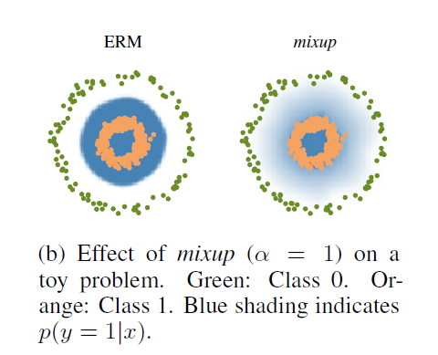

# CNNのためのデータ拡張法を勉強＆簡単に実装してみた
# はじめに

本記事では、畳み込み込みニューラルネットワーク（CNN）に役立つ、データ拡張の手法を勉強たので、簡単にまとめ、実装の例を示したいと思います。間違いなどがあれば教えていただけますと幸いです。

データ拡張では、分類や物体検出をする際に、回転や、反転、移動、せん断、色味の変更などを加えることで、訓練データのバリデーションを高め、認識精度を高めるために行います。

  

以下のページでは、その例が画像と共に紹介されているのでイメージがつきやすいです。

[https://jp.mathworks.com/help/deeplearning/ug/image-augmentation-using-image-processing-toolbox.html](https://jp.mathworks.com/help/deeplearning/ug/image-augmentation-using-image-processing-toolbox.html)

また、上のような多種多様なデータ拡張も、そのオプションを1行書き加えるだけで実行可能な場合が多く（以下の記事はMATLABの例）、非常に簡単にデータ拡張も試せるようになっています。

[https://jp.mathworks.com/help/deeplearning/ref/augmentedimagedatastore.html](https://jp.mathworks.com/help/deeplearning/ref/augmentedimagedatastore.html)

  
# それ以外のデータ拡張の手法の例

上で述べたシンプルな方法に加えて、その他にも有効なデータ拡張の手法が知られています。ここでは、

1) **random erasing や CutOut** 2)** Mix-upやSamplePairing** の2つを紹介したいと思います。

  
# Random Erasing について

ここで紹介する私の実装のコードについては、以下のページからダウンロードできます。

[https://github.com/KentaItakura/CNN-classification-using-random-erasing-and-cut-out](https://github.com/KentaItakura/CNN-classification-using-random-erasing-and-cut-out)

  

Random Erasingの論文は以下のとおりです。

[Zhong, Z., L. Zheng, G. Kang, S. Li, and Y. Yang. "Random erasing data augmentation. arXiv 2017." arXiv preprint arXiv:1708.04896.](https://arxiv.org/abs/1708.04896)

cutoutの論文は以下の通りです。

[DeVries, Terrance, and Graham W. Taylor. "Improved regularization of convolutional neural networks with cutout." arXiv preprint arXiv:1708.04552 (2017).](https://arxiv.org/abs/1708.04552)

  

Random Erasingのイメージは、以下の論文の図がわかりやすいです。画像にグレーのマスクや、ランダムな色のマスクがかかっていますね。

> rectangle region in the image and erase its pixels with **random values** or the ImageNet **mean pixel value**

ランダムな値や、ImageNet内の画像のピクセル値の平均値（おそらくグレーにちかい）でマスクをすると論文中にも書いています。


図出展：Zhongら (2017) [1] より

  

また、動画にすると以下のようなイメージです。


  

また、cutoutについても同様で、以下の図が論文中にあります。ひとまずこの記事では、特にrandom erasingとcutoutの区別はせず、訓練画像にマスクをかけてデータ拡張を行う方法を試します。


ここでのパラメータとしては、マスクをかけるときのマスクの大きさや縦横比の範囲、マスクの色（例：ランダムか、白か、グレーか黒か）、マスクの数（もしそのようなカスタマイズをしたい場合は）などが考えられます。論文中でも、そのような条件を変えて実験をしているので、詳しいパラメータと精度やデータセットの関係はもとの論文を参照いただけますと幸いです。

　以下に、私の方で実装したコードで、CIFAR-10を用いて比較したときの結果です。左がRandom Erasingを行った場合、右がそうでない場合です。左のRandom Erasingがある場合は、テストデータによる分類精度は77.6%で、ない場合は73.1%と、確かに精度が高まりました。今回は非常にシンプルなネットワークで行っているということもあり、論文よりはずいぶんと精度が低いです。

  


## random erasing/cutoutの効果について

　論文中にもあるとおり、確かにこれらの方法を用いることで精度の向上を確認することができました。例えばcutoutの論文には、

> cutoutの主なモチベーションは、物体が隠れてしまう（オクルージョン）問題への対処です。オクルージョンは物体認識、物体追跡、姿勢推定など、多くのコンピュータビジョンのタスクにおいて発生する問題です。マスクをかけて新しい画像を生成することで（データ拡張をすることで）、より多くの画像の文脈（規則性や連続性など）を考慮するよう学習させることができます。

とあります。

　また、random erasingの論文でも、オクルージョンのあるテストデータには、CNNがうまく機能しないことが考えられ、オクルージョンは非常に悩ましいことである、との記述があります。実際に本文中で、テストデータにもマスクをかけて（オクルージョンを作って）分類精度を確認したところ、random erasingを用いて学習したモデルがうまく機能すると確認されています。

　実際にオクルージョンがある画像セットを用意して、random erasing/cutoutの有無でどのようなテスト結果になるかを比べるとオクルージョン対策が成功し、分類精度が向上したのかどうかの確認につながりそうな気がしました。


  
# Mix-up / SamplePairingについて

次に、Mix-up や SamplePairingについて紹介します。

もととなる論文は以下のとおりです。

[Zhang, Hongyi, Moustapha Cisse, Yann N. Dauphin, and David Lopez-Paz. "mixup: Beyond empirical risk minimization." arXiv preprint arXiv:1710.09412 (2017).](https://arxiv.org/abs/1710.09412)

[Inoue, Hiroshi. "Data augmentation by pairing samples for images classification." arXiv preprint arXiv:1801.02929 (2018).](https://arxiv.org/abs/1801.02929)

私のほうで簡単に実装したコードはこちらになります。混ぜる比率を単純に一様分布からランダムに決めているので注意が必要です。

[https://github.com/KentaItakura/Data-Augmentation-using-Mix-up-with-Custom-Training-Loop-with-MATLAB](https://github.com/KentaItakura/Data-Augmentation-using-Mix-up-with-Custom-Training-Loop-with-MATLAB)

  

これらの方法では、マスクをして一部を隠すのではなく、以下のように、画像どうしをブレンドします。以下の例では、自動車と梨の画像がブレンドされていることがわかります。そして、例えば色味を1:1でブレンドした場合は、正解データを0.5ずつ分け与えます。例えば、その分類では、犬、猫、牛を扱っていて、犬と猫の画像をブレンドした場合、正解ラベルは [0.5, 0.5, 0] とします。ブレンドする比率を変えることも可能です。

```matlab:Code
I1=imread('car2.jpg');
I2=imread('pears.png');
Iblend=imfuse(I1,imresize(I2,[size(I1,1),size(I1,2)]),'blend');
figure;montage({I1,I2,Iblend});
```


また、Inoue (2018) [4] から以下の図を引用しています。SamplePairingがある場合とない場合では、ある場合のほうが誤差が低く、分類の問題に対して効果的であると示されています。また、SamplePairingにおける、設定を複数試していますが、どの場合もbaselineの方法よりも性能がいいことがわかります。

  


図出展：Inoue (2018) [4] より

  

以下の右側の図（*mixup*）にあるとおり、画像どうしを混ぜ合わせて、それに応じてラベルの値も0と1の間を取るので、クラスどうしの境界面にグラデーションができていることがわかります。これにより、正則化の効果がうまれ、認識精度が向上するようです。正則化に関しては、`dropout`との比較も本文中にありました。



出展：[Zhang, Hongyi et al. (2017) [3] より.](https://arxiv.org/abs/1710.09412)

  

**mix-upに関する考察に関してはこちらの記事が参考になりました。**

[https://www.inference.vc/mixup-data-dependent-data-augmentation/](https://www.inference.vc/mixup-data-dependent-data-augmentation/)

# 次に読みたい論文

このmix-upと関連する論文の中で、特に次に読みたい論文と参考になる記事を挙げます。

   -  **BC-learning**: Mixupはただ2枚の異なる画像を混ぜるだけなのに対して、BC-Learningは**異なるクラスの異なる2枚の画像**を混ぜるのだそうです 

[Tokozume, Y., Ushiku, Y. and Harada, T., 2018. Between-class learning for image classification. In Proceedings of the IEEE Conference on Computer Vision and Pattern Recognition (pp. 5486-5494).](https://arxiv.org/abs/1711.10284)

https://qiita.com/koshian2/items/d0661842eb66a7c0c0f3

   -  **Mixmatch: **半教師あり学習の手法で、これまでの半教師あり学習のアプローチをひとまとめにしたそうです 

[Berthelot, D., Carlini, N., Goodfellow, I., Papernot, N., Oliver, A. and Raffel, C., 2019. Mixmatch: A holistic approach to semi-supervised learning. arXiv preprint arXiv:1905.02249.](https://arxiv.org/abs/1905.02249)

https://www.slideshare.net/harmonylab/mixmatch-a-holistic-approach-to-semi-supervised-learning

   -  **Cutmix: **cutoutとmixupを合わせたような方法 

[Yun, S., Han, D., Oh, S.J., Chun, S., Choe, J. and Yoo, Y., 2019. Cutmix: Regularization strategy to train strong classifiers with localizable features. In Proceedings of the IEEE/CVF International Conference on Computer Vision (pp. 6023-6032).](https://openaccess.thecvf.com/content_ICCV_2019/html/Yun_CutMix_Regularization_Strategy_to_Train_Strong_Classifiers_With_Localizable_Features_ICCV_2019_paper.html)

https://qiita.com/wakame1367/items/82316feb7268e56c6161

   -  **Manifold mixup: **Manifold Mixuでは、より特徴量が整理された中間層で混ぜるMIXUPを行うデータ拡張手法だそうです。 

[Verma, V., Lamb, A., Beckham, C., Najafi, A., Mitliagkas, I., Lopez-Paz, D. and Bengio, Y., 2019, May. Manifold mixup: Better representations by interpolating hidden states. In International Conference on Machine Learning (pp. 6438-6447). PMLR.](http://proceedings.mlr.press/v97/verma19a.html)

[https://akichan-f.medium.com/%E6%9C%80%E7%B5%82%E5%B1%A4%E3%81%A7mixup%E3%81%97%E3%81%9F%E3%82%89%E8%89%AF%E3%81%95%E3%81%92%E3%81%A0%E3%81%A3%E3%81%9F%E4%BB%B6-bd2ff167c388](https://akichan-f.medium.com/%E6%9C%80%E7%B5%82%E5%B1%A4%E3%81%A7mixup%E3%81%97%E3%81%9F%E3%82%89%E8%89%AF%E3%81%95%E3%81%92%E3%81%A0%E3%81%A3%E3%81%9F%E4%BB%B6-bd2ff167c388)

  
# まとめ

   -  本記事で紹介したものはどれも実装をシンプルに行うことができ、かつ分類や物体検出で精度向上も期待できるようなよいデータ拡張方法であると感じました。 
   -  本記事を執筆している2021年12月現在では、これらの手法を改良したものや、より効果的なものが提案させているので、またそれらも勉強してみたいです 

  
# その他参考にさせていただいたWEBの記事

[https://qiita.com/koshian2/items/909360f50e3dd5922f32](https://qiita.com/koshian2/items/909360f50e3dd5922f32)

[https://qiita.com/takurooo/items/a3cba475a3db2c7272fe](https://qiita.com/takurooo/items/a3cba475a3db2c7272fe)

[https://nonbiri-tereka.hatenablog.com/entry/2020/01/06/082921](https://nonbiri-tereka.hatenablog.com/entry/2020/01/06/082921)

[https://wazalabo.com/mixup_3.html](https://wazalabo.com/mixup_3.html)

# 参考文献

[1] [Zhong, Z., L. Zheng, G. Kang, S. Li, and Y. Yang. "Random erasing data augmentation. arXiv 2017." arXiv preprint arXiv:1708.04896.](https://arxiv.org/abs/1708.04896)

[2] [DeVries, Terrance, and Graham W. Taylor. "Improved regularization of convolutional neural networks with cutout." arXiv preprint arXiv:1708.04552 (2017).](https://arxiv.org/abs/1708.04552)

[3] [Zhang, Hongyi, Moustapha Cisse, Yann N. Dauphin, and David Lopez-Paz. "mixup: Beyond empirical risk minimization." arXiv preprint arXiv:1710.09412 (2017).](https://arxiv.org/abs/1710.09412)

[4] [Inoue, Hiroshi. "Data augmentation by pairing samples for images classification." arXiv preprint arXiv:1801.02929 (2018).](https://arxiv.org/abs/1801.02929)
